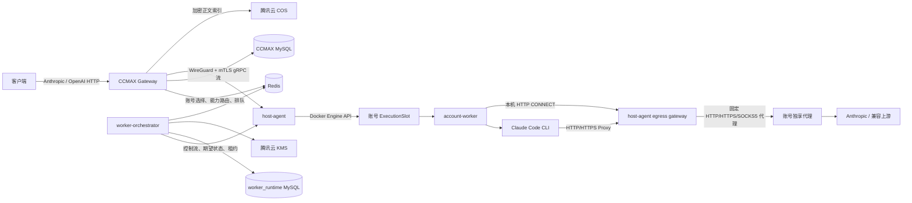

# Claude 账号隔离执行面 V1 PRD

> 文档状态：待确认
> 编写日期：2026-08-29
> 目标分支：确认后从 `ccmax` 创建 `codex/claude-execution-plane-v1`
> 关联系统：Sub2API、CCMAX Manager、Claude Code、Docker、腾讯云基础设施

## 1. 背景

当前 CCMAX Manager 已具备账号池、代理池、OAuth/Setup Token/Session Key 授权、账号调度、会话粘性、并发控制、容量排队、用量统计、归档和错误诊断能力，但请求执行仍与控制面强耦合：

- CCMAX 直接持有并使用账号凭证访问上游；
- 账号没有独立的 Linux/Claude Code 运行环境；
- 无法保证登录、Token 刷新和推理请求始终从同一固定代理出口发起；
- 账号生命周期与 Docker 运行时没有一致的状态机；
- 多节点失联时缺少防止同一账号双活的 fencing 机制；
- `cli_native` 与直接 OAuth/API 请求尚未形成可独立启停、可按能力路由的双执行模式。

V1 将“VM”正式定义为逻辑执行槽位 `ExecutionSlot`。一个账号对应一个隔离 Docker 槽位，而不是一台独立云服务器。多个账号槽位运行在同一台 Ubuntu Docker 宿主机上；底层通过 `ExecutionProvider` 抽象，为未来 KVM/Firecracker 保留扩展边界。

## 2. 产品目标

### 2.1 核心目标

1. 一个账号固定对应一个隔离 Docker 执行槽位。
2. 支持两种解耦执行模式：
   - `cli_native`：在账号槽位中启动官方 Claude Code CLI 执行；
   - `oauth_api`：账号 worker 直接调用 Anthropic 兼容上游。
3. 登录、授权交换、Token 刷新、配额查询和推理请求必须使用同一账号固定代理出口。
4. CCMAX 继续负责客户端鉴权、计费、账号选择、排队和协议入口，但不接触新执行面中的明文账号凭证。
5. 支持多 worker 节点、资源感知调度、节点 drain、镜像灰度和无双活故障转移。
6. 保持 Anthropic Messages 兼容入口及现有 OpenAI Chat Completions 兼容入口。
7. V1 支撑：
   - 账号数量：200；
   - 半年账号数量：500；
   - 预期同时活跃账号：200；
   - 峰值进行中或排队客户端请求：1000。

### 2.2 成功标准

- 新账号只有在凭证、代理、槽位和 worker 探活全部成功后才可调度；
- 任意时刻同一账号最多只有一个有效 execution epoch；
- worker 节点无法绕过固定代理直连公网；
- `cli_native` 与 `oauth_api` 可分别启停、分别限流、分别记录健康状态；
- 不支持 CLI 无损表达的请求不会静默丢字段，而是自动转 `oauth_api` 或明确拒绝；
- 节点故障转移时间小于 120 秒，且不发生账号双活；
- fake 上游压测可稳定维持 1000 个长连接；
- 首台 4C8G 试点节点受到明确容量保护，不因过量建槽导致宿主机失稳。

## 3. 非目标

V1 明确不包含：

- 邮箱/密码自动登录；
- Kubernetes；
- 真实 KVM、LXD 或 Firecracker 执行器；
- 云服务器自动购买、自动扩容；
- OpenAI Responses API 和 Batch API；
- 跨地域 active-active；
- 对外汇聚、转售 Pro/Max 订阅 OAuth；
- 保证所有 Anthropic 请求都能使用 `cli_native`；
- 在生产请求中通过 MITM 捕获 Claude CLI 的最终 TLS 请求；
- 通过修改 UA、metadata 或 system prompt 改变 Anthropic 的计费归类。

## 4. 合规边界

本系统仅用于内部、自有或明确授权账号。订阅 OAuth 不用于代表第三方用户提供公开聚合服务。

截至 2026-08-29，官方说明 `claude -p` / Agent SDK 的订阅用量使用独立 Agent SDK 额度。`claude-cli` User-Agent、合法 `metadata.user_id` 或 Claude Code 身份提示词不能改变该计费规则。遇到 “Third-party apps now draw from your extra usage” 类错误时，系统必须按真实计费/额度错误处理，不得尝试通过身份注入绕过。

参考：

- [Claude Code Authentication](https://code.claude.com/docs/en/authentication)
- [Claude Code Legal and Compliance](https://code.claude.com/docs/en/legal-and-compliance)
- [Claude Code Environment Variables](https://code.claude.com/docs/en/env-vars)

## 5. 名词定义

| 名词 | 定义 |
|---|---|
| 控制面 | CCMAX Manager 与 worker-orchestrator 所在环境 |
| worker 节点 | 运行 host-agent 和账号 Docker 槽位的 Ubuntu 主机 |
| ExecutionSlot | 一个账号的逻辑隔离运行单元；V1 后端为 Docker |
| account-worker | 槽位内常驻的轻量 Go 服务，负责 CLI/API 执行 |
| cli_native | 由官方 Claude Code CLI 发起模型请求的执行模式 |
| oauth_api | worker 直接构造并发起 Anthropic API 请求的执行模式 |
| execution epoch | 防止同一账号在多节点双活的单调递增代际号 |
| 执行租约 | 带 epoch、有效期和签名的短期执行授权 |
| 凭证租约 | worker 一次性获取并解密账号密文凭证的短期授权 |
| legacy | 现有 CCMAX 直接访问上游的链路 |

## 6. 总体架构



### 6.1 关键原则

- worker-orchestrator 是控制面，不转发模型 SSE 流量；
- CCMAX 通过 WireGuard 私网直连目标节点的 host-agent；
- host-agent 不向公网发布 worker 端口；
- host-agent 使用 Docker Engine API，不通过 shell 拼接执行 `docker` CLI；
- Claude Code CLI 仅存在于账号 worker 镜像内；
- Sub2API/CCMAX 不绑定 `container_id`，只绑定稳定的 `slot_id`；
- Docker 细节封装在 `ExecutionProvider` 内。

## 7. 组件职责

### 7.1 CCMAX Manager

继续负责：

- 下游 SK 鉴权、用户和分组权限；
- Anthropic/OpenAI 协议入口；
- 账号选择、策略、费用、配额和会话粘性；
- 分组级排队/立即拒绝开关；
- 请求能力识别及执行模式选择；
- 客户端错误响应与 SSE 转发；
- 使用量入账、正文审计索引和管理 UI；
- 账号状态变更的事务 Outbox 写入。

不再负责：

- 解密新执行面账号凭证；
- 直接刷新新执行面账号 Token；
- 直接访问新执行面账号的 Anthropic 上游；
- 管理 Docker 容器。

### 7.2 worker-orchestrator

- 管理节点注册、证书、标签、容量和心跳；
- 消费 CCMAX Outbox，维护账号期望运行状态；
- 资源感知放置槽位；
- 管理 slot assignment、epoch、执行租约和凭证租约；
- 使用腾讯云 KMS 对账号凭证做信封加密；
- 管理镜像版本、canary、drain、重建和回滚；
- 周期性 reconciliation，修复事件丢失或中途失败；
- 代码从 V1 起支持多副本 leader election，初期部署一个实例。

### 7.3 host-agent

- 以受约束的 systemd 服务运行；
- 通过 Docker Engine API 创建、探活、停止和销毁槽位；
- 上报节点资源、镜像、槽位和会话状态；
- 验证 mTLS、执行票据和 epoch；
- 将 CCMAX gRPC 请求路由到私有 Docker 网络中的目标 worker；
- 提供本机 HTTP CONNECT egress gateway；
- 将 HTTP CONNECT 转换为账号绑定的 HTTP/HTTPS/SOCKS5 上游代理；
- 使用网络策略禁止 worker 绕过 egress gateway；
- 租约失效时拒绝新上游连接并关闭旧 epoch 连接。

### 7.4 account-worker

- 常驻但保持低资源占用；
- 接收一次性凭证租约，把明文凭证只写入内存或 tmpfs；
- 在固定出口内完成 Session Key 交换、OAuth code 交换、Setup Token/API Key 验证和 Token 刷新；
- 执行 `cli_native` 或 `oauth_api`；
- 管理 CLI 回合、session ID、tmpfs transcript 和 MCP Bridge；
- 将刷新后的新凭证通过加密轮换接口回传 orchestrator；
- 不包含 Docker Socket，不挂载宿主目录。

## 8. 执行模式

### 8.1 配置层级

账号保存：

- `allowed_modes`: `cli_native`、`oauth_api` 的集合；
- `preferred_mode`: 默认优先模式；
- 两个模式各自的健康状态、错误和恢复时间；
- 两个模式各自的并发限制。

分组保存：

- `execution_policy`: `auto | cli_only | api_only`；
- 排队/立即拒绝策略；
- 允许的 CLI 镜像版本或发布通道。

普通客户端不能通过 HTTP Header 自由指定模式。仅拥有独立管理权限的调试请求可强制模式。

### 8.2 并发

默认值：

- `cli_native_limit = 1`；
- `oauth_api_limit = 3`；
- `total_limit = 3`。

因此单账号默认最多：

- 1 CLI + 2 API；或
- 3 API。

限额可按账号或调度策略覆盖。

### 8.3 模式健康隔离

- `cli_native` 和 `oauth_api` 独立记录 `healthy / cooling / billing_blocked / auth_failed / unavailable`；
- Agent SDK 额度类 400 只禁用 `cli_native`；
- API Key/OAuth 认证错误按实际影响模式标记；
- 自动模式只允许在尚未向客户端输出内容时，尝试一次兼容备用模式或备用账号；
- 防止同一种全局错误在账号池内形成重试风暴。

## 9. 协议兼容

### 9.1 对外接口

V1 支持：

- `POST /v1/messages`；
- `POST /v1/messages/count_tokens`；
- `GET /v1/models`；
- `GET /v1/models/{id}`；
- `GET /models` 及单模型别名；
- `POST /v1/chat/completions`，由 CCMAX 先转换为 Anthropic 语义。

V1 不支持 Responses API 和 Batch API。

### 9.2 能力矩阵

| 能力 | cli_native | oauth_api | auto 行为 |
|---|---:|---:|---|
| 文本 system/messages | 支持，system 作为 CLI 附加指令 | 支持 | 优先策略决定 |
| 流式/非流式 | 支持 | 支持 | 均可 |
| model | 支持 CLI 可识别模型 | 支持映射 | 不兼容时转 API |
| max_tokens | 映射 `CLAUDE_CODE_MAX_OUTPUT_TOKENS` | 原样支持 | 均可 |
| 固定 thinking budget | 映射 `MAX_THINKING_TOKENS` | 原样支持 | 无法精确映射时转 API |
| adaptive effort | 映射 CLI effort | 原样支持 | 无法精确映射时转 API |
| 客户端 tools/tool_result | MCP Bridge | 原生 Anthropic tool use | 均可 |
| 多个并行 tool_use | 支持 | 支持 | 均可 |
| 已知 CLI session 的历史 | `--resume` | 完整 messages | 均可 |
| 未知会话的大段 assistant/tool 历史 | 不保证无损 | 支持 | 转 API |
| image/document 内容块 | V1 验证后按矩阵开放 | 支持 | 默认转 API |
| cache_control 精确控制 | 不保证 | 支持 | 转 API |
| temperature/top_p/top_k | 不保证 | 支持/按现有策略处理 | 转 API |
| service_tier/inference_geo/speed/beta | 不保证 | 按分组策略支持 | 转 API |
| 原始字节透传 | 不支持 | 支持现有 raw passthrough | 转 API |

强制 `cli_native` 且能力不支持时，返回 `400 unsupported_feature`，不得静默删除字段。

### 9.3 CLI 请求转换原则

- `cli_native` 不经过 CCMAX 当前 Claude Code identity、billing 或 metadata 注入，避免与官方 CLI 自身生成的内容重复；
- 客户端 system 只作为经过校验的附加指令提供给 CLI；
- 使用 `--safe-mode`、`--strict-mcp-config` 和 `--tools ""`；
- 仅注入当前请求生成的 MCP Bridge 工具；
- 禁用内置 Bash、Read、Edit、Web、Agent 等工具；
- 不使用 `--dangerously-skip-permissions`；
- `oauth_api` 继续使用现有 CCMAX 请求转换、原始透传和兼容策略。

### 9.4 `/count_tokens` 与 `/models`

- `/count_tokens` 始终由账号 worker 经固定代理调用真实上游，不启动 Claude CLI，不返回本地估算值；
- `/models` 由 CCMAX 本地汇总，只有 `runtime=ready` 且目标模式健康的账号参与；
- `/models` 不为每次请求调用 worker 或 Anthropic。

### 9.5 usage 和响应标识

- 尽量保留 CLI/上游真实 message ID、model、stop reason 和 usage；
- CLI 累计 usage 按事件计算当前回合增量；
- 无法可靠计算时记录诊断，不伪造 Token；
- 正文与用量入账解耦，入账以最终成功回合为准；
- 输出前失败可以重试，输出任何 SSE 后禁止自动重试。

## 10. CLI 会话与 MCP Bridge

### 10.1 CLI 生命周期

- 每个模型回合启动一个 `claude -p` 进程；
- 后续回合通过 `--resume <session-id>` 恢复；
- CLI 版本固定在 worker 镜像中并关闭自动更新；
- 初始候选基线为本机已验证存在的 Claude Code `2.1.177`，正式固定前必须通过 canary；
- CLI transcript 存储在 tmpfs；
- 调度粘性、CLI session 空闲和 MCP tool_result 等待默认均为 15 分钟，分别可配置。

### 10.2 Session 解析优先级

1. `X-Session-Id`；
2. `metadata.user_id` 中的稳定 session 标识；
3. CCMAX 使用“下游 API Key + system/tools 指纹 + 首条 user 消息”生成稳定哈希。

Session ID 和哈希不能包含或暴露原始用户内容。

### 10.3 Tool Bridge

1. CCMAX 将客户端 tools 转为临时 MCP tool schema；
2. CLI 调用 MCP tool 时，Bridge 不执行工具；
3. worker 将一个或多个 `tool_use` 返回客户端并结束当前 HTTP 响应；
4. CLI 进程与 MCP 调用保持挂起；
5. 客户端下一次 `/v1/messages` 提交对应 `tool_result`；
6. worker 验证 session、tool_use ID 和幂等状态后恢复 CLI；
7. 超时、重复、未知或过期结果返回明确会话状态错误。

支持并行 tool_use，结果可在同一后续请求中批量提交。

### 10.4 取消

- 排队或生成期间客户端断开，立即向 Redis 队列、gRPC、worker 和 CLI 传播取消；
- 已返回 tool_use 的挂起会话不因 HTTP 连接结束而取消；
- 已产生客户端可见输出后不进行透明重试；
- 管理员强制 drain 可终止挂起会话。

## 11. 账号上号与凭证

### 11.1 支持方式

- Claude Session Key；
- OAuth callback/code；
- Setup Token；
- 加密凭证导入；
- Cookie 批量导入；
- 普通 Anthropic API Key；
- 不包含邮箱/密码自动登录。

必须区分：

- Claude Session Key（例如 `sk-ant-sid...`）可复用现有 CCMAX 链路换取 AT/RT；
- 普通 API Key（例如 `sk-ant-api...`）不能换取 AT/RT，只能作为 API Key 使用。

### 11.2 两阶段上号

1. CCMAX 创建 pending 账号并预留独享代理；
2. 事务写入 Outbox，账号不可调度；
3. orchestrator 分配临时 slot 和 epoch；
4. worker 在固定出口内完成凭证交换或验证；
5. 成功凭证进入 KMS 信封加密 vault；
6. worker 探活成功后账号变为 `ready + schedulable`；
7. 失败时销毁临时容器，但保留 pending 账号与原代理预约供重试；
8. Session Key、authorization code、PKCE verifier 等临时值到期立即擦除。

### 11.3 Token 刷新

- 刷新只能在账号 worker 内经固定出口进行；
- 同账号 Token 操作串行化；
- 刷新成功后生成新 credential version；
- 新版本经 KMS 加密写回 vault 后才切换 active version；
- 旧版本保留短暂回滚窗口后销毁 DEK；
- CCMAX 只接收 hint、过期时间和健康状态，不接收明文 Token。

## 12. 凭证安全

### 12.1 信封加密

- 每个账号凭证版本使用独立随机 DEK；
- 数据使用 AES-256-GCM 加密；
- AAD 至少包含 account ID、credential version 和 auth type；
- DEK 使用腾讯云 KMS CMK 加密；
- orchestrator 通过腾讯云 CAM 实例角色访问 KMS，不保存长期 SecretId/SecretKey；
- KMS 开启删除保护和最小权限策略。

### 12.2 凭证租约

- worker 仅通过一次性、短期、绑定 slot/epoch 的租约获取凭证；
- 明文只存在于 worker 内存和 tmpfs；
- 容器销毁、账号 drain、租约撤销或 epoch 变化时清理 tmpfs；
- 不在日志、审计、错误、环境导出或 Docker inspect 可见字段中保存明文；
- worker 不接收 KMS 权限。

### 12.3 现有凭证迁移

- 账号级单向迁移；
- 先迁 canary，再分批扩展；
- KMS 加密、解密校验和字段完整性验证成功后，清空该账号原 `credentials_json`；
- 不同时长期保留明文与密文；
- 未迁账号继续 legacy；
- 已迁账号不能回退到需要 CCMAX 明文凭证的旧链路。

## 13. 代理与网络隔离

### 13.1 固定出口

- 一个账号固定绑定一个代理；
- 上号、Token 交换、刷新、配额和推理使用同一代理；
- 支持 HTTP、HTTPS 和 SOCKS5；
- Claude CLI 原生不支持 SOCKS，因此 worker 始终连接 host-agent 的本机 HTTP CONNECT 网关，由网关完成 SOCKS 转换；
- worker 不持有远端代理密码。

### 13.2 网络

- 节点通过 WireGuard hub-and-spoke 接入；
- CCMAX、orchestrator、host-agent 使用 mTLS；
- 节点使用一次性注册令牌领取短期证书并自动轮换；
- 吊销节点证书时同步撤销 execution lease；
- worker 容器不发布宿主端口；
- worker Docker 网络只允许访问 host-agent egress 和必要的本机控制地址；
- 禁止 worker 直接访问公网、Docker API、宿主文件系统和其他账号网络。

## 14. Docker 安全基线

每个账号 worker：

- 非 root 用户；
- 只读根文件系统；
- 独立 tmpfs 保存凭证和 session；
- `cap_drop: ALL`；
- `no-new-privileges`；
- seccomp + AppArmor；
- 无 Docker Socket；
- 无宿主目录挂载；
- PID、CPU、内存、临时盘和打开文件数限制；
- 禁用 swap 依赖；
- 镜像内禁用 Claude CLI 自动更新、插件同步、hooks、IDE/Chrome 集成和自动 memory；
- worker 镜像和依赖产生 SBOM，并在进入 canary 前完成漏洞扫描。

初始资源参数仅作为试点保护值，最终由压测校准：

- worker 内存 reservation：128 MiB；
- worker 内存 hard limit：1.5 GiB；
- CPU hard limit：1 core；
- PIDs：128；
- tmpfs：256 MiB；
- 节点至少保留 20% CPU/内存给系统与 host-agent。

## 15. 调度、队列和租约

### 15.1 节点放置

- resource-aware least-loaded + spread；
- 支持节点标签、区域、代理地域和镜像能力约束；
- 账号落位后保持稳定；
- 仅在节点故障、管理员 drain、镜像迁移或资源不足时迁移；
- 不因为短期负载波动频繁搬迁账号。

### 15.2 首台节点限制

首个 worker 节点：

- 地址：`43.172.83.39`；
- Ubuntu Server 22.04 LTS amd64；
- 腾讯云 KVM CVM；
- 4 vCPU / 约 8 GiB 内存 / 120 GB 磁盘；
- 当前未安装 Docker；
- V1 试点上限：20 个常驻槽位、4 个并行 CLI、12 个并行 oauth_api 请求。

该节点不是 200 活跃账号的唯一生产节点。生产节点数量必须由实际 worker/CLI 压测结果计算，不在 PRD 中凭空固定。

### 15.3 排队

- 分组级 `queue | reject` 开关；
- 默认最长排队 120 秒；
- 单次执行默认最长 15 分钟；
- 全局进行中 + 排队请求上限 1000；
- 按 API Key 公平轮转，保留账号优先级和会话粘性；
- 每个 Key 设置独立队列上限，防止独占全局队列；
- 队列满或超时返回 Anthropic 格式 `529` 和 `Retry-After`；
- 非流请求保持 HTTP 等待；流请求可沿用 CCMAX SSE heartbeat。

### 15.4 防双活

- host-agent 每 15 秒续租；
- 45 秒未续租，节点和槽位停止接收新请求；
- 90 秒后 orchestrator 才允许在其他节点重建；
- 每次重新分配递增 execution epoch；
- egress gateway 只接受当前 epoch 的有效票据；
- 旧节点恢复后不能继续发起上游请求；
- 时间全部可配置。

### 15.5 Redis 故障

- 生产环境 Redis 必填；
- Redis 保存分布式队列、实时路由、并发计数和短租约；
- MySQL 保存期望状态和 epoch；
- Redis或控制面不可用时停止接收新请求；
- 旧执行租约到期后关闭上游连接，安全优先于短时可用性；
- Redis 数据均可从 MySQL和运行状态重建。

## 16. 生命周期状态机

### 16.1 账号状态

```text
pending_auth
  -> provisioning
  -> ready
  -> draining
  -> archived
  -> deleted

provisioning -> onboarding_failed
ready -> runtime_error | auth_failed | billing_blocked
archived -> provisioning -> ready
deleted -> provisioning -> ready       # 回收站恢复
deleted -> purged                      # 批量彻底清除
```

账号 `schedulable=true` 的必要条件：

- 账号业务状态 active；
- 至少一个允许模式 healthy；
- 代理有效；
- slot ready；
- 节点 healthy；
- execution lease 有效；
- 不处于 drain、归档、删除或凭证迁移中。

### 16.2 槽位状态

```text
requested -> pulling -> creating -> starting -> ready
ready -> busy | draining | unhealthy
draining -> stopped -> destroyed
unhealthy -> recreating | destroyed
```

所有 lifecycle operation 必须幂等，并接受重复 Outbox 事件。

### 16.3 归档

- 任意未删除账号可归档，不再限制为死亡账号；
- 停止新调度，默认 drain 最长 15 分钟；
- 管理员可选择立即强制终止；
- 销毁 slot；
- 保留 KMS 密文和原代理预约；
- 恢复时先验证原代理和凭证，再重建 slot；
- 另提供“归档并释放代理”显式操作。

### 16.4 软删除与回收站

- 软删除立即停止调度、撤销租约并销毁 slot；
- 保留密文凭证和代理预约，不自动过期；
- 支持批量恢复：重新验证代理与凭证，重建成功后才恢复调度；
- 支持批量彻底清除：删除密文、DEK、运行数据和可恢复入口；
- 彻底清除后仅保留不含正文和凭证的统计/审计墓碑；
- 一次性代理继续标记为已使用。

### 16.5 修改凭证或代理

采用两阶段切换：

1. 停止新调度并 drain 旧 slot；
2. 创建没有正式 execution lease 的候选 slot；
3. 使用临时 onboarding lease 验证新凭证/代理；
4. 成功后递增 epoch，激活新 slot 并销毁旧 slot；
5. 失败时销毁候选 slot，恢复旧 slot 与旧配置。

## 17. Outbox 与一致性

### 17.1 原则

账号数据库事务不能与 Docker 操作组成分布式事务，因此采用 transactional outbox + reconciliation：

- 账号变更与 Outbox 事件同一 MySQL 事务提交；
- orchestrator 至少一次消费；
- event ID、account ID、desired generation 组成幂等键；
- orchestrator 每 30 秒对比期望状态和实际状态；
- UI 展示 `provisioning`、`draining` 和失败步骤，不把异步操作伪装成已完成。

### 17.2 主要事件

- `account.runtime.provision_requested`；
- `account.runtime.drain_requested`；
- `account.runtime.destroy_requested`；
- `account.runtime.restore_requested`；
- `account.credential.migrate_requested`；
- `account.credential.rotate_requested`；
- `account.proxy.change_requested`；
- `slot.image.rollout_requested`；
- `node.drain_requested`。

## 18. 数据设计

### 18.1 CCMAX 数据库增量

建议新增或扩展：

- `accounts.execution_allowed_modes`；
- `accounts.execution_preferred_mode`；
- `accounts.execution_migration_status`；
- `accounts.runtime_status`；
- `accounts.runtime_error_code`；
- `accounts.runtime_generation`；
- `groups.execution_policy`；
- `groups.worker_queue_mode`；
- `groups.worker_image_channel`；
- `account_mode_health`；
- `runtime_outbox`；
- `runtime_operation_audit`；
- 回收站批量恢复/彻底清除所需字段。

保留现有账号、分组、代理、usage、dispatch_sessions、计费和审计表作为业务事实来源。

### 18.2 `worker_runtime` 独立数据库

建议表：

- `nodes`：节点身份、标签、容量、版本和状态；
- `node_enrollments`：一次性注册令牌摘要和有效期；
- `node_certificates`：证书序列号、状态和到期时间；
- `slots`：稳定 slot ID、account ID、provider、desired state；
- `slot_assignments`：node、container ref、epoch、image、actual state；
- `execution_leases`：epoch、owner、有效期；
- `credential_vault`：账号 active credential version；
- `credential_versions`：ciphertext、encrypted DEK、AAD、KMS key version；
- `credential_leases`：一次性领取状态；
- `runtime_sessions`：session hash、slot、状态、到期时间，不存正文；
- `provisioning_jobs`：步骤、重试、错误和幂等键；
- `image_releases`：镜像 digest、CLI 版本、canary 状态；
- `node_drain_jobs`；
- `reconciliation_runs`。

两个数据库可使用同一 MySQL 服务，但不得建立跨数据库外键；使用不可变 account ID 逻辑关联。

### 18.3 Redis

Redis 保存：

- slot route cache；
- node/slot 短心跳；
- execution lease TTL；
- per-account/per-mode/global concurrency；
- API Key 公平队列；
- session route；
- tool wait notification；
- 短期幂等和取消状态。

不得在 Redis 中保存明文凭证或正文。

## 19. 内部协议

使用 protobuf/gRPC，所有接口携带 trace ID、account ID、slot ID、epoch 和 deadline。

### 19.1 Orchestrator Control API

至少包含：

- `EnrollNode`；
- `RenewNodeCertificate`；
- `NodeControlStream`；
- `ReportNodeStatus`；
- `ReconcileSlot`；
- `AcquireExecutionLease`；
- `AcquireCredentialLease`；
- `CommitCredentialRotation`；
- `ReportSlotHealth`；
- `DrainNode`；
- `RolloutImage`。

### 19.2 Host Data Plane API

- `ExecuteMessages`：双向/服务端流；
- `CountTokens`；
- `SubmitToolResults`；
- `CancelExecution`；
- `GetSlotHealth`。

gRPC 必须实现背压和客户端取消，不能先把完整 SSE 缓存在内存。

### 19.3 Worker Local API

host-agent 通过隔离 Docker 网络访问 worker，不发布宿主端口。每次调用都验证短期 slot ticket 和 epoch。

## 20. 错误契约

客户端始终收到 Anthropic 兼容错误 JSON：

| 场景 | HTTP | 对外错误 |
|---|---:|---|
| 下游 SK 无效 | 401 | `authentication_error` |
| 请求无法由强制 CLI 表达 | 400 | `unsupported_feature` |
| tool/session 状态冲突 | 409 | `session_state_conflict` |
| 无 ready slot | 503 | `service_unavailable` |
| 排队满或超时 | 529 | `overloaded_error` + `Retry-After` |
| worker/节点输出前失败 | 502/503 | 规范化网关错误 |
| 上游 429 | 429 | 保留可公开的 retry 信息 |

不得向普通客户端暴露：

- 账号邮箱、账号 ID；
- 节点 IP、slot/container ID；
- 代理地址和密码；
- 上游凭证；
- Claude CLI stderr 原文；
- 内部 KMS、Redis、MySQL 错误。

管理端可以查看经过脱敏和权限控制的原始分类信息。

## 21. 日志、正文与审计

### 21.1 正文存储

- 保存脱敏后的请求/响应正文；
- 默认保留 3 天，管理员可配置 N 天；
- 正文压缩后使用 KMS 信封加密存入腾讯云 COS；
- MySQL 只保存对象 ID、哈希、大小、保留期和审计字段；
- 请求和响应单侧默认最多保存 2 MiB；
- 超限只保存结构摘要、字段列表和哈希；
- COS lifecycle 与应用清理任务双重保证到期删除。

### 21.2 永不落盘字段

无论管理员如何配置，以下字段都不得进入日志或正文对象：

- Authorization、X-Api-Key、Cookie；
- Access Token、Refresh Token、Session Key、Setup Token；
- OAuth code、PKCE verifier；
- KMS plaintext DEK；
- 代理用户名和密码。

### 21.3 权限

- 正文查看使用独立 RBAC 权限；
- 每次查看、下载、搜索均写审计；
- 批量导出默认关闭；
- COS 对象不提供绕过 CCMAX 审计的长期公开 URL；
- V1 新管理页面只提供中文，不新增英文翻译。

## 22. 可观测性

### 22.1 指标

各服务暴露 Prometheus 指标并支持 OTLP，至少包括：

- 节点 CPU、内存、磁盘、槽位容量；
- slot 状态和重建次数；
- CLI 启动耗时、回合耗时、退出码；
- oauth_api 请求耗时；
- 各模式 healthy/cooling/blocked 数量；
- 队列长度、等待时间、拒绝数；
- execution lease/credential lease 状态；
- proxy 连接和出口失败；
- Token 刷新成功率；
- 各分类 400/401/403/429/5xx；
- KMS、Redis、MySQL、COS 错误；
- gRPC 流量、断连、背压和取消。

### 22.2 告警

预留通用 Webhook，告警至少覆盖：

- 节点离线；
- slot 连续重建失败；
- 账号双活防护触发；
- KMS 解密/加密失败；
- 队列持续高水位；
- billing 400 激增；
- 代理出口异常；
- Token 刷新失败；
- COS 清理失败。

## 23. 管理界面

在 CCMAX 独立管理界面 `ccmax-manager/web` 中新增中文页面/模块：

### 23.1 节点

- 节点状态、版本、资源、标签、区域；
- slot 使用量、CLI/API 活跃数；
- 心跳、证书、WireGuard 状态；
- drain、恢复调度、删除节点；
- 镜像预拉取和升级进度。

### 23.2 槽位

- account、slot、node、provider、epoch；
- desired/actual state；
- 镜像与 CLI 版本；
- 代理出口状态；
- session/tool wait；
- 日志和最后错误；
- recreate、迁移、强制终止；
- 批量 drain/recreate/migrate。

### 23.3 账号列表增强

- allowed/preferred mode；
- 两个模式独立健康；
- runtime 状态、节点、slot；
- 凭证迁移状态；
- 上号、归档、软删除、恢复、彻底清除的异步进度；
- “排队中/立即拒绝”策略展示；
- 账号变更时的两阶段切换进度。

### 23.4 镜像发布

- 精确镜像 digest 和 Claude CLI 版本；
- canary 账号/节点；
- rollout、暂停、回滚；
- N/N-1 协议兼容状态。

### 23.5 正文审计

- 按 request ID、时间、账号 hint、分组和错误类型查询；
- 独立权限；
- 查看/下载审计；
- 保留期设置，默认 3 天；
- 批量导出默认禁用。

## 24. 镜像与发布

- 使用腾讯云 TCR 私有仓库；
- 节点只拉取镜像，不从源码构建；
- 镜像使用不可变 digest；
- Claude CLI 固定精确版本，设置 `DISABLE_AUTOUPDATER=1`；
- 发布先进入少量 canary slot；
- canary 验证协议、工具、usage、认证、代理和资源后再逐批 rollout；
- 升级使用统一 drain；
- 支持一键回滚到上一个 approved digest；
- host-agent、worker、proto 保证 N/N-1 兼容。

## 25. 部署与灾备

### 25.1 初期部署

- worker-orchestrator 与现有 CCMAX 主站部署在同一控制面服务器，但作为独立容器/进程；
- orchestrator 代码支持多副本，初期运行一个实例；
- `43.172.83.39` 仅运行 host-agent 和 worker slots；
- 通过 Ansible 安装 Docker Engine、WireGuard、host-agent、UFW 和 systemd；
- Ansible 必须幂等，不覆盖已有 80/443 服务；
- 开发和本地验收结束后，必须再次获得部署确认，才能修改远端服务器。

### 25.2 备份

- CCMAX 与 worker_runtime MySQL 每日全量备份，保留 30 天；
- MySQL binlog 提供约 15 分钟 RPO；
- 目标 RTO 2 小时；
- Redis 不作为事实来源，不要求持久备份；
- KMS CMK 开启删除保护；
- COS 正文按配置生命周期删除，不纳入长期备份；
- worker slot 和 session 均可重建，不备份容器文件系统。

## 26. 代码目录方案

```text
sub2api/
├── ccmax-manager/
│   ├── execution_client.go             # host-agent 数据面客户端
│   ├── execution_capability.go         # auto 能力矩阵
│   ├── execution_dispatch.go           # 模式选择与请求调度
│   ├── execution_outbox.go              # transactional outbox
│   ├── execution_lifecycle.go           # 上号/归档/删除/恢复状态机
│   ├── execution_errors.go              # 错误规范化
│   ├── execution_audit.go               # COS 正文索引与访问审计
│   ├── migrations/                      # CCMAX schema 增量
│   └── web/
│       ├── app.js                       # 节点/槽位/发布/审计 UI
│       ├── index.html
│       └── styles.css
├── execution-plane/
│   ├── go.mod
│   ├── api/
│   │   └── proto/execution/v1/
│   │       ├── control.proto
│   │       ├── dataplane.proto
│   │       └── worker.proto
│   ├── cmd/
│   │   ├── orchestrator/main.go
│   │   ├── host-agent/main.go
│   │   └── worker/main.go
│   ├── internal/
│   │   ├── orchestrator/
│   │   │   ├── placement/
│   │   │   ├── reconcile/
│   │   │   ├── lease/
│   │   │   ├── credentials/
│   │   │   └── rollout/
│   │   ├── hostagent/
│   │   │   ├── control/
│   │   │   ├── dataplane/
│   │   │   ├── egress/
│   │   │   ├── networkpolicy/
│   │   │   └── docker/
│   │   ├── worker/
│   │   │   ├── auth/
│   │   │   ├── cli/
│   │   │   ├── oauthapi/
│   │   │   ├── mcpbridge/
│   │   │   ├── session/
│   │   │   └── response/
│   │   ├── provider/
│   │   │   ├── provider.go             # ExecutionProvider 接口
│   │   │   └── docker/provider.go      # V1 实现
│   │   ├── security/
│   │   │   ├── mtls/
│   │   │   ├── ticket/
│   │   │   └── envelope/
│   │   ├── storage/
│   │   │   ├── mysql/
│   │   │   ├── redis/
│   │   │   └── cos/
│   │   └── observability/
│   ├── migrations/mysql/
│   ├── images/
│   │   ├── worker/Dockerfile
│   │   └── fake-claude/Dockerfile
│   ├── deploy/
│   │   ├── compose/
│   │   └── ansible/
│   │       ├── inventories/
│   │       ├── roles/docker/
│   │       ├── roles/wireguard/
│   │       ├── roles/host_agent/
│   │       └── roles/node_hardening/
│   ├── test/
│   │   ├── fakeclaude/
│   │   ├── fakeanthropic/
│   │   ├── integration/
│   │   ├── e2e/
│   │   └── load/
│   └── Makefile
├── docs/prd/
│   └── claude-execution-plane-v1.md
└── openspec/changes/
    └── add-claude-execution-plane-v1/   # PRD 确认后创建
```

未来 KVM/Firecracker 只能通过新增 `ExecutionProvider` 实现接入，业务调度和账号表不得依赖 Docker container ID。

## 27. 配置项

关键配置全部支持环境变量或配置文件，敏感值不进入仓库：

- MySQL/Redis/COS/TCR/KMS；
- WireGuard 网段和 hub 地址；
- mTLS CA、证书 TTL 和轮换窗口；
- node heartbeat/offline/failover 时间；
- queue/reject、queue timeout、global outstanding；
- session/tool TTL，默认 15 分钟；
- request deadline，默认 15 分钟；
- 每节点 slots/CLI/API 容量；
- worker cgroup 限制；
- Claude CLI 镜像 digest；
- 正文保留 N 天，默认 3 天；
- 正文单侧上限，默认 2 MiB；
- Prometheus/OTLP/Webhook。

配置校验失败时服务拒绝启动，不使用不安全默认值回退。

## 28. 测试与验收

### 28.1 单元测试

- capability matrix；
- mode health；
- epoch/fencing；
- credential envelope encryption；
- Outbox 幂等；
- queue fairness；
- session/tool state machine；
- Anthropic SSE/非流响应转换；
- 错误脱敏；
- 生命周期状态转换。

### 28.2 集成测试

- MySQL + Redis + fake KMS/COS；
- Docker provider 创建/销毁/重建；
- host-agent 与 worker mTLS/gRPC；
- HTTP/HTTPS/SOCKS5 代理出口；
- fake Claude CLI stream-json；
- 多并行 tool_use/tool_result；
- Token 刷新轮换；
- CCMAX Outbox 到 slot ready 全链路。

### 28.3 E2E

- Session Key 上号；
- OAuth/Setup Token/API Key；
- cli_native 流式/非流式；
- oauth_api 流式/非流式；
- OpenAI Chat Completions 转换；
- count_tokens/models；
- 归档、删除、批量恢复、批量彻底清除；
- 修改代理/凭证两阶段切换；
- 镜像 canary/rollback；
- 节点 drain/failure/rejoin；
- Redis/KMS/MySQL/COS 故障注入；
- 输出前重试与输出后禁止重试。

### 28.4 压测

主压测使用 fake Claude CLI + fake Anthropic，少量授权账号只做真实 canary：

- 1000 个同时进行中或排队长连接；
- 200 个账号 runtime state；
- API Key 公平队列；
- 节点离线与重建；
- CLI crash、代理断连、Token 刷新冲突；
- 大请求、慢 SSE、客户端主动取消；
- 24 小时 soak test。

验收指标：

- `oauth_api` 网关附加延迟 p95 < 100 ms；
- CLI 启动附加延迟 p95 < 1.5 s；
- 节点故障转移 < 120 s；
- 无账号双活；
- 无明文凭证落盘/入日志；
- 1000 长连接下服务无 OOM、死锁或无界队列；
- 客户端取消能够释放队列、gRPC 和 CLI 资源；
- 试点 4C8G 节点不突破配置容量。

## 29. 风险与缓解

| 风险 | 影响 | 缓解 |
|---|---|---|
| `claude -p` 使用独立 Agent SDK 额度 | cli_native 返回 billing 400 | 模式健康隔离、明确告警、auto 转兼容 API 模式，不伪装身份 |
| Claude CLI 不是完整 Messages API | 字段语义丢失 | 能力矩阵、强制模式明确 400、无法无损时转 oauth_api |
| CLI 升级改变 stream-json/system/tool 行为 | 协议回归 | 精确版本、fake/canary、镜像 digest、N/N-1、快速回滚 |
| MCP tool 挂起占用资源 | 槽位泄漏 | 15 分钟 TTL、并发上限、取消、管理员强制终止 |
| 节点失联造成双活 | 同账号并发与风控风险 | epoch、短租约、egress fencing、重建等待窗口 |
| host-agent 持有 Docker 管理能力 | 节点提权风险 | systemd 隔离、窄 RPC、mTLS、allowlist、无任意容器参数 |
| worker 绕过代理 | IP 一致性失效 | 隔离网络、host egress gateway、网络策略、无公网路由 |
| KMS/COS/Redis 故障 | 无法上号或调度 | fail closed、分类告警、可重建状态、MySQL 事实来源 |
| 正文日志包含敏感信息 | 数据泄漏 | 强制认证字段剔除、加密 COS、RBAC、审计、3 天默认生命周期、2 MiB 上限 |
| 4C8G 节点容量不足 | OOM/高延迟 | 20 slot/4 CLI/12 API 初始硬限制、20% 系统预留、基准压测 |
| 单向凭证迁移回滚困难 | canary 失败影响账号 | 小批次迁移、迁移前验证、旧账号保持 legacy、禁止双写明文 |
| 同一账号模式并发超额 | 上游限流 | cli/api/total 三层 semaphore，与现有 RPM/ITPM 策略联动 |
| 归档/删除中断流请求 | 客户端错误 | 默认 15 分钟 drain、强制终止需显式选择、输出后不重试 |
| raw body 留存成本增长 | COS 成本/合规压力 | N 天可配置、默认 3 天、压缩、大小上限、生命周期删除 |

## 30. 开发顺序

### 阶段 0：OpenSpec 与基线

1. 根据本 PRD创建 OpenSpec proposal/design/spec/tasks；
2. 固化现有 CCMAX 网关、账号、归档、队列和授权测试基线；
3. 建立 fake Claude CLI 与 fake Anthropic；
4. 定义 protobuf 和状态机，不连接生产账号。

### 阶段 1：执行面骨架

1. 创建 `execution-plane` Go module；
2. 完成 proto、mTLS、配置和 observability；
3. 实现 Docker `ExecutionProvider`；
4. 实现 host-agent/worker 最小探活；
5. 本地 Docker E2E。

### 阶段 2：orchestrator 与一致性

1. `worker_runtime` migrations；
2. node enrollment/heartbeat；
3. placement、slot reconcile；
4. execution epoch/lease/fencing；
5. CCMAX transactional outbox；
6. 节点失联故障注入。

### 阶段 3：凭证与上号

1. KMS envelope encryption；
2. credential lease/rotation；
3. 固定代理 egress gateway；
4. Session Key/OAuth/Setup Token/API Key/Cookie 上号；
5. Token 刷新；
6. canary 账号单向迁移工具。

### 阶段 4：oauth_api 数据面

1. CCMAX 模式路由与 gRPC 数据面；
2. Anthropic stream/nonstream；
3. count_tokens/models；
4. OpenAI Chat Completions 入口复用；
5. usage、错误、取消和输出前重试；
6. 并发与公平队列。

### 阶段 5：cli_native

1. 固定 Claude CLI 镜像；
2. safe/strict/no-builtins 启动；
3. stream-json adapter；
4. session/resume/tmpfs；
5. max_tokens/thinking 映射；
6. MCP Bridge 与并行 tool_use；
7. 能力矩阵和模式健康隔离；
8. Agent SDK billing 400 分类测试。

### 阶段 6：生命周期与 UI

1. provisioning/drain/archive/delete/restore/purge；
2. 凭证/代理两阶段切换；
3. 节点、槽位、镜像、会话、队列、租约页面；
4. 批量操作；
5. COS 正文审计与权限；
6. 中文 UI 验证。

### 阶段 7：发布、压测与试点准备

1. TCR、SBOM、镜像扫描；
2. canary/rollout/rollback；
3. Ansible 与安全检查；
4. 1000 长连接、故障注入、24 小时 soak；
5. 生成首台节点容量报告；
6. 提交远端部署前检查清单；
7. 获得单独确认后才修改 `43.172.83.39`。

## 31. 上线门禁

以下条件全部满足才允许将账号迁入新执行面：

- OpenSpec 和安全评审完成；
- 单元、集成、E2E、race、vet、前端检查通过；
- KMS/COS/Redis/MySQL 恢复演练通过；
- 防双活和代理不可绕过测试通过；
- 凭证扫描确认无明文落盘；
- fake 1000 长连接压测通过；
- 少量授权 canary 账号验证通过；
- 管理端可观测、drain、rollback 可用；
- 远端部署获得单独批准。

## 32. 待实施时提供的环境参数

这些参数不阻塞 PRD确认，但在对应开发/部署阶段必须由环境提供：

- CCMAX 控制面主机和内部地址；
- 腾讯云 KMS region、CMK ID、CAM role；
- COS bucket/region；
- TCR registry/namespace；
- MySQL `worker_runtime` DSN；
- Redis 地址与 TLS/认证；
- WireGuard hub 地址和规划网段；
- 内部 CA/证书策略；
- 告警 Webhook；
- 真实 canary 账号和代理白名单。

## 33. 确认门

本文件确认前：

- 不创建开发分支；
- 不创建 OpenSpec change；
- 不修改业务代码；
- 不安装 Docker；
- 不修改 `43.172.83.39`。

用户确认本 PRD 后，按“阶段 0”开始执行；任何远端安装和防火墙/WireGuard 修改仍需在部署阶段单独确认。
