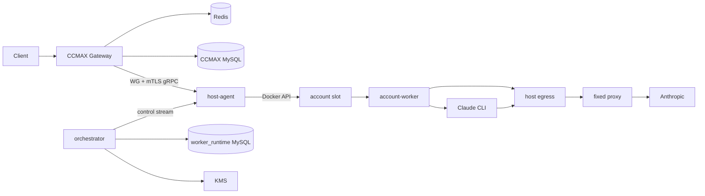

## Context

CCMAX 当前是单体 Go 服务，账号凭证存于 `accounts.credentials_json`，网关直接选择账号、转换请求并访问上游。队列、并发、会话、代理、配额和统计已成熟，不应在执行面重写。

目标是在不替换这些业务能力的前提下，把“账号实际执行”下沉到隔离槽位，并确保控制面、运行时、凭证和网络边界清晰。V1 账号规模 200、半年 500、活跃账号 200、峰值 outstanding 1000。首台 4C8G 仅用于试点。

## Goals / Non-Goals

**Goals:**

- 一个账号一个稳定 `ExecutionSlot`，V1 使用 Docker。
- CCMAX 继续做业务调度；orchestrator 只做运行时控制，不成为 SSE 热路径。
- 登录、刷新、配额和请求固定同一代理出口。
- 双模式独立、可灰度、可删改；不能无损 CLI 化的请求自动进入 API 模式。
- 多节点安全故障转移，严格防双活。
- 凭证信封加密、短租约、最少明文暴露。
- 完整生命周期、中文管理 UI、指标、审计和压测。

**Non-Goals:** 以 PRD 第 3 节为准。

## Architecture

## Decisions

### 1. 控制面不转发模型流量

CCMAX 在完成账号选择后，通过 WireGuard 私网直接调用目标 host-agent 的 gRPC 数据面。orchestrator 只管理节点、slot、租约、凭证和镜像期望状态。

这样避免 1000 个 SSE 长连接集中经过 orchestrator，也使控制面重启不必成为所有流量的 relay 瓶颈。

### 2. 使用稳定 Slot 抽象隔离 Docker

CCMAX 与 runtime DB 只存 `slot_id`、provider 和 epoch，不把 container ID 当业务标识。`ExecutionProvider` 定义 Create、Inspect、Start、Drain、Stop、Destroy、ExecHealth；V1 只实现 Docker。

### 3. Outbox + Reconciliation 代替分布式事务

账号变更与 `runtime_outbox` 在同一 CCMAX MySQL 事务提交。orchestrator 至少一次消费，按 event ID 和 desired generation 幂等执行，并周期性对比期望/实际状态。

账号在 slot ready 前保持不可调度。UI 展示真实异步阶段，不提前显示成功。

### 4. worker_runtime 使用独立数据库

同一个 MySQL 服务新增 `worker_runtime` database，orchestrator 独占写入。只通过 account ID 逻辑关联 CCMAX，不建跨库外键。Redis 只保存可重建的短状态。

### 5. KMS 信封加密与一次性凭证租约

每个 credential version 使用独立 AES-256-GCM DEK，AAD 绑定 account/version/auth type；DEK 由腾讯云 KMS CMK 加密。orchestrator 使用 CAM instance role，worker 无 KMS 权限。

worker 使用绑定 slot/epoch 的一次性租约领取凭证，明文仅进入内存/tmpfs。刷新成功先提交新密文版本，再切换 active version。

上号采用两段式、双向流激活：host-agent 先用一次性 ticket 获取
worker 进程级 X25519 公钥，再转发 orchestrator 为该 worker 密封的上号包。
worker 完成固定出口验证后，只在同一激活流中返回密封给 orchestrator
rotation key 的 credential commit；host-agent 转发密文并在 Vault/KMS 提交成功后
回传 version acknowledgement，worker 此后才切换内存 active credential。rotation
key 与上号材料位于同一个认证包，host-agent 不能替换接收方公钥。旧 unary
activation 只保留给显式 fake/local E2E，不作为生产上号路径；新增流式 RPC 保持
additive wire compatibility。

### 6. 固定代理由 host egress 强制执行

worker 和 CLI 只配置本机 HTTP CONNECT endpoint。host-agent 根据 slot 和有效 execution ticket 选择唯一远端 HTTP/HTTPS/SOCKS5 代理。Docker 网络策略禁止其他公网路由；worker 不持有远端代理密码。

### 7. execution epoch 是双活 fencing token

host-agent 15 秒续租，45 秒未续租停止新调度，90 秒后才允许其他节点重建。重新分配递增 epoch；egress 只接受当前 epoch。Redis/控制面故障时 fail closed。

### 8. 双模式共享调度但独立转换

账号有 allowed/preferred modes，分组有 auto/cli_only/api_only。默认 `cli=1`、`api=3`、`total=3`。模式健康分别记录。

`cli_native` 不经过 CCMAX Claude identity/billing/metadata 注入；`oauth_api` 继续现有转换。能力矩阵拒绝静默丢字段。

### 9. CLI 每回合进程 + 15 分钟 tmpfs session

每回合执行 `claude -p`，后续使用 `--resume`。max_tokens/thinking 通过官方环境变量映射。CLI 使用 safe mode、strict MCP、禁用全部 built-in tools，自动更新关闭。

session 粘性、tmpfs session 和 tool wait 默认均为 15 分钟。CLI 调用 MCP tool 时进程挂起，Bridge 把 tool_use 返回客户端，后续 tool_result 恢复同一调用。

### 10. Redis 公平队列

分组可 queue 或 reject。queue 模式按 API Key 公平轮转，并保留账号优先级和 session pin。默认等待 120 秒，执行 15 分钟，全局 outstanding 1000。Redis 不可用时不接受新执行。

### 11. 生命周期统一 drain

归档、软删除、节点维护、镜像升级和凭证/代理切换共用 drain，默认最多 15 分钟，可显式强制终止。归档和软删除保留密文与代理预约；软删除支持批量恢复和批量彻底清除。

### 12. 正文进入加密 COS

脱敏正文压缩并信封加密存 COS，默认 3 天，单侧 2 MiB；MySQL 只保存索引。认证头、Token、Cookie、PKCE 和代理密码永不落盘。查看使用独立 RBAC 且全审计。

### 13. 镜像不可变并逐步发布

worker/host-agent 镜像使用 TCR digest，Claude CLI 固定精确版本。发布先 canary，再 drain rollout，支持回滚。协议保证 N/N-1。

### 14. 首台节点保守限容

`43.172.83.39` 初始只允许 20 slots、4 CLI、12 API。worker 初始 reservation 128 MiB、hard limit 1.5 GiB、CPU 1 core、PIDs 128、tmpfs 256 MiB；最终值由基准测试调整。

## Failure Semantics

- 输出前 worker/node/mode 失败：最多一次安全重试。
- 输出任何客户端可见 SSE 后：不自动重试。
- billing 400：只标记受影响 mode，避免账号池重试风暴。
- queue full/timeout：529 + Retry-After。
- no ready slot：503。
- forced unsupported CLI feature：400 `unsupported_feature`。
- client disconnect：取消队列、gRPC、worker 和 CLI；已返回 tool_use 的 session 保留到 TTL。

## Rollout

- 新执行面按 group/account flag 灰度。
- 现有账号默认 legacy；只有单向凭证迁移成功后才启用 worker。
- 已启用执行面的分组中新账号默认走新上号链路。
- 先 fake 全链路，再少量授权 canary；远端安装仍需要单独批准。

## Risks

- CLI/Agent SDK 计费分类导致 billing 400；通过 mode health、明确告警和合规 fallback 处理。
- CLI 协议升级；通过精确版本、fake/canary 和 digest rollback 处理。
- host-agent Docker 权限；通过窄 RPC、systemd sandbox、allowlist 和 mTLS 限制。
- 正文留存；通过强制剔除、加密 COS、RBAC、审计和生命周期降低风险。
- 单向凭证迁移难回滚；通过小批 canary、完整校验和旧账号保持 legacy 降低风险。

## Deployment Inputs

KMS region/CMK/CAM role、COS bucket、TCR namespace、MySQL/Redis、WireGuard 网段、内部 CA、控制面地址和告警 Webhook 在相应阶段提供，不阻塞接口与本地 fake 实现。
