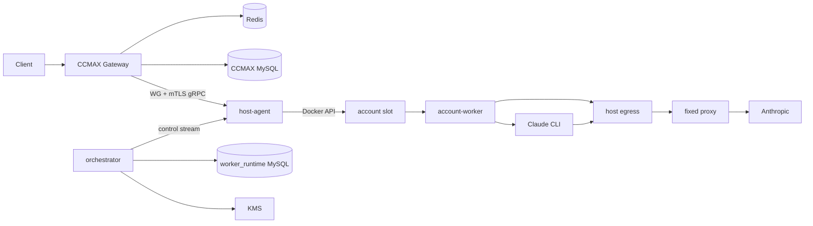

## Context

CCMAX 当前是单体 Go 服务，账号凭证存于 `accounts.credentials_json`，网关直接选择账号、转换请求并访问上游。队列、并发、会话、代理、配额和统计已成熟，不应在执行面重写。

目标是在不替换这些业务能力的前提下，把“账号实际执行”下沉到隔离槽位，并确保控制面、运行时、凭证和网络边界清晰。V1 账号规模 200、半年 500、活跃账号 200、峰值 outstanding 1000。首台 4C8G 仅用于试点。

## Goals / Non-Goals

**Goals:**

- 一个账号一个稳定 `ExecutionSlot`，V1 使用 Docker。
- CCMAX 继续做业务调度；orchestrator 只做运行时控制，不成为 SSE 热路径。
- 登录、刷新、配额和请求固定同一代理出口。
- 双模式独立、可灰度、可删改；不能无损 CLI 化的请求自动进入 API 模式。
- 多节点安全故障转移，严格防双活。
- 凭证信封加密、短租约、最少明文暴露。
- 完整生命周期、中文管理 UI、指标、审计和压测。

**Non-Goals:** 以 PRD 第 3 节为准。

## Architecture

## Decisions

### 1. 控制面不转发模型流量

CCMAX 在完成账号选择后，通过 WireGuard 私网直接调用目标 host-agent 的 gRPC 数据面。orchestrator 只管理节点、slot、租约、凭证和镜像期望状态。

这样避免 1000 个 SSE 长连接集中经过 orchestrator，也使控制面重启不必成为所有流量的 relay 瓶颈。

### 2. 使用稳定 Slot 抽象隔离 Docker

CCMAX 与 runtime DB 只存 `slot_id`、provider 和 epoch，不把 container ID 当业务标识。`ExecutionProvider` 定义 Create、Inspect、Start、Drain、Stop、Destroy、ExecHealth；V1 只实现 Docker。

### 3. Outbox + Reconciliation 代替分布式事务

账号变更与 `runtime_outbox` 在同一 CCMAX MySQL 事务提交。orchestrator 至少一次消费，按 event ID 和 desired generation 幂等执行，并周期性对比期望/实际状态。

账号在 slot ready 前保持不可调度。UI 展示真实异步阶段，不提前显示成功。

### 4. worker_runtime 使用独立数据库

同一个 MySQL 服务新增 `worker_runtime` database，orchestrator 独占写入。只通过 account ID 逻辑关联 CCMAX，不建跨库外键。Redis 只保存可重建的短状态。

### 5. KMS 信封加密与一次性凭证租约

每个 credential version 使用独立 AES-256-GCM DEK，AAD 绑定 account/version/auth type；DEK 由腾讯云 KMS CMK 加密。orchestrator 使用 CAM instance role，worker 无 KMS 权限。

worker 使用绑定 slot/epoch 的一次性租约领取凭证，明文仅进入内存/tmpfs。刷新成功先提交新密文版本，再切换 active version。

上号采用两段式、双向流激活：host-agent 先用一次性 ticket 获取
worker 进程级 X25519 公钥，再转发 orchestrator 为该 worker 密封的上号包。
worker 完成固定出口验证后，只在同一激活流中返回密封给 orchestrator
rotation key 的 credential commit；host-agent 转发密文并在 Vault/KMS 提交成功后
回传 version acknowledgement，worker 此后才切换内存 active credential。rotation
key 与上号材料位于同一个认证包，host-agent 不能替换接收方公钥。旧 unary
activation 只保留给显式 fake/local E2E，不作为生产上号路径；新增流式 RPC 保持
additive wire compatibility。

NodeControl 使用两个独立的 additive 命令完成生产上号，密文不得塞入通用
`metadata`：orchestrator 先发送 credential-key 命令，host-agent 连接已经启动的
worker 并回传该进程的 X25519 公钥；orchestrator 随后发送 secure-activation
命令，其中的上号包必须绑定该公钥、runtime account hash、slot、epoch、credential
lease 和 proxy lease。激活期间 worker 返回的 rotation ciphertext 通过同一条
NodeControl 流转发给 orchestrator credential sink，Vault/KMS 成功后再由控制流
回传 version acknowledgement。公钥结果通过幂等 command observer 交给
provisioning workflow；activation command 在未配置 credential sink 时禁止调度。

CCMAX 提交的临时上号材料先通过独立的内部 mTLS intake 进入 orchestrator，立即
封装为默认 30 分钟有效的 KMS encrypted onboarding intent。AAD 必须绑定 intent
ID、account、目标 generation、source type 和 auth type；CCMAX 的账号事务与
`runtime_outbox` 只保存 opaque `onboarding_intent_id`。provisioning job 使用稳定
owner claim intent，同 owner 在 claim 有效期内可重放，其他 owner、错误 generation
或过期 intent 均 fail closed。orchestrator 必须先验证精确 worker process key，之后
才允许在内存中解密并构造 activation command；只有 Vault version ACK、精确
slot/epoch/image 健康验证和 activation command 成功全部完成后才能消费 intent。
完成响应丢失时，同 owner 再次 complete 必须幂等成功；失败或超时的 intent 在
claim/intent TTL 约束内可恢复，明文和 DEK 不得进入 outbox、日志或审计。

`onboarding_workflows` 持久化 intent owner 与 node/slot/epoch/image、key/activation
两个 command ID 及公开的 worker process key。NodeControl observer 对成功和失败的
两类结果均执行二次 binding 校验并幂等落库；polling controller 每次只推进一个
durable step：发送 key command、使用已落库公钥 claim/decrypt intent 并发送
activation、最后在 activation success 后消费 intent。发送先于 dispatched 标记，
observer 允许结果从发送前状态直接推进，以覆盖“命令已发、进程在标记前退出”的
窗口；稳定 command ID 和 observer 幂等性覆盖重复结果与重启恢复。

orchestrator 由单一组合根构造 credential crypto/Vault、intent Vault、固定 rotation
recipient、observer、credential sink、NodeControl、intake、controller 和 polling
runner。任一依赖缺失时整个组合 fail closed，不能注册半套 RPC。NodeControl 与
intake 注册到同一 TLS 1.3 gRPC server；listener 使用
`VerifyClientCertIfGiven` 仅为首次 node enrollment 保留无证书握手，其余方法继续在
应用层强制 node/service 精确身份。有界 runner 每页最多 100 个 active workflow，
逐项调用一次 `Advance` 并隔离单项失败。

rotation recipient 不得由组合根在每次启动时临时生成。其 X25519 私钥由调用方从
KMS/受保护持久层恢复后显式注入；恢复构造器消费并清零私钥输入，组合根在失败或
退出时销毁其拥有的 key。这样重启前已下发 activation 的 worker ciphertext 仍可由
同一 recipient 解密。

生产 runtime 默认关闭并由独立配置边界 fail closed。MySQL 只接受启用证书校验的
TLS TCP DSN；配置格式化必须隐藏完整 DSN。CA/server 私钥和 rotation recipient
envelope 只从绝对路径、非 symlink、owner-only regular file 加载，证书文件也不得
由 group/other 写入。server leaf 必须由同一 execution CA 签发、具有 serverAuth
usage 并匹配显式 server name。rotation 私钥使用与账号 credential 不同的
`sub2api.service-key.v1` AAD schema，且只允许通过腾讯 KMS CVM instance role 解封；
不接受 raw private-key env/file 或长期云 API secret fallback。

CCMAX 与 intake 使用独立的 service client identity
`spiffe://sub2api.execution/service/ccmax`，不能复用 host-agent node identity。
CCMAX intake client 强制 TLS 1.3 mTLS，成功、拒绝和 receipt 校验失败均清零请求
material；服务端立即把输入交给 KMS intent vault 并清零 protobuf bytes。单账号
创建只在显式 `execution_onboarding` 开启时走该链路，且要求固定代理和稳定
`Idempotency-Key`；已迁移账号重新授权异步返回 202。legacy 默认路径保持不变。
旧批量入口仍需 worker result 到 CCMAX 的邮箱/去重 projection，不能在该 projection
落地前用 provisional 账号冒充完成。

外部 `Idempotency-Key` 只标识 CCMAX 的 canonical submission；每个 execution intake
attempt 使用独立随机内部 key。CCMAX 在创建 outbox 事件前先持久化 opaque receipt，
丢失 Create 响应时以精确内部 key 调用 lookup-only Recover。Recover 不解密 intent，
且使用 NotFound、Aborted、FailedPrecondition、Unavailable 区分未创建、精确过期、
身份/生命周期冲突和存储不可用。只有精确过期 attempt 可通过 CAS 换 key，晚到的旧
Recover/Create 响应必须被 attempt + 完整 immutable identity/fingerprint 栅栏拒绝。
Create 消费并清零材料，Recover 保留材料；状态机必须据此避免二次 Create。

固定代理预约由 CCMAX 独占写入。onboarding 账号事务递增 generation 后，先以
account + generation 唯一键持久化 `runtime_proxy_reservations` 并 enqueue
`account.proxy_reservation.granted`，再 enqueue onboarding transition；两者必须同事务且
grant sequence 在前。authority payload 固定为 opaque reservation ID、proxy binding ID 和
binding revision，不含 endpoint 或 credential。revoke 锁定精确旧 binding，允许账号已经
推进到更新 generation，但不得撤销更新预约；grant/revoke event ID 均唯一且只接受 exact
replay。普通账号 transition allowlist 与 authority-event allowlist 必须解耦。

proxy binding ID 只允许 CCMAX proxy row 的 canonical positive decimal ID。active reservation
与尚未 grant、但已被 nonlegacy 账号引用的 proxy 都参与占用计算；proxy/pool 的 identity-bearing
修改、delete/restore/quarantine/test 必须在任何写入或 probe 网络 I/O 前锁定 proxy 并检查占用。
allocator 同样排除 active reservation。successor onboarding 采用同事务
`revoke(old) -> generation CAS -> grant(new) -> onboarding event`；普通 transition 不 revoke。
旧 archive/delete/restore API 对任一 matched runtime-owned 账号整批 fail closed，避免在统一
drain/destroy/lifecycle 协调器落地前破坏“归档/软删保留预约”的产品语义。

execution-plane 以独立 strict handler 投影 `proxy_reservation_grants`，拒绝未知、重复、缺失
或 secret-looking JSON 字段。`proxy_leases` 绑定 reservation + account + desired generation +
binding revision + slot/epoch；授予和校验同时要求 active reservation、健康 running
assignment、相同 image、未过期 execution lease。assignment 在分配时固化 slot desired
generation，不能复用仅表示 actual state 变化次数的 `actual_generation`。迁移新增的 nullable
provenance 让旧行 fail closed，且 production schema gate 同时检查新表和关键列，以拒绝只
执行了一部分的多语句 DDL。

同镜像 generation 漂移也是 immutable assignment drift，reconcile 必须 drain/destroy/release，
不能仅按 image 判断。proxy lease 的 SQL/memory 时间统一到 UTC 微秒，并同时约束 proxy lease、
execution lease 与 reservation 均未在校验时刻之后创建。

durable workflow 只能由 atomic healthy-slot starter 创建。starter 在一个事务内锁定不含密文的
intent metadata、ready slot、同 generation/image 且 fresh/healthy/running 的 assignment、live
execution lease 与 trusted reservation，并同时插入 proxy lease 和 workflow。migration 010
以 `intent_id` 唯一键保证一个 intent 至多一个 workflow；schema gate 校验索引确实唯一且精确
覆盖 `intent_id`。exact replay 先返回原 workflow/proxy binding，再考虑当前 health。旧 durable
`CreateProvisioning` 不再由 production repository 暴露。activation 在 claim/decrypt 前后均重验
current proxy lease authority，竞态失效时擦除已打开输入且不 dispatch。生产 outbox routing、
intent/slot 选择和 duplicate drain/archive 仍未组装。

账号创建 submission 保存版本化的非秘密 canonical fingerprint，不包含凭证、代理文本
或自由文本。外部 key 丢失时，服务端提供按 account ID 的非秘密 status/resume API，
只复用数据库中的原 external/internal key，不允许客户端以新 key 接管。resume 在 RPC
前短事务锁定并复核 account/generation/proxy/migration/runtime lifecycle；create 请求还
必须复核 fingerprint。RPC 不得在数据库事务内执行，完成投影或 drain/destroy/archive/
delete 后的旧 submission 不得再次推进账号。

worker commit 后由 orchestrator 从已认证 normalized credential 中提取严格有界的
非密钥身份/订阅字段，并以 workflow/intent/account/generation/slot/epoch/credential
lease/proxy lease/version 全绑定落入 `onboarding_results`。该写入位于 Vault version
提交之后、worker version ACK 之前；丢失响应重试复用原 version 并幂等补投影。
CCMAX 通过同一 mTLS intake service 按 intent/account/generation 查询，但 repository
只返回 `completed` workflow。邮箱冲突仍必须进入统一 drain/归档状态机，不能在结果
查询回调里直接覆盖另一账号的 execution-owned credential。

完成结果同时返回同一 workflow 已认证绑定的稳定 `slot_id` 与 `execution_epoch`；CCMAX
后台 reconciler 只扫描当前 generation 的 provisioning outbox 引用，并在一个事务中重验
intent/account/generation/slot、空明文凭据和账号存活状态后，写入
`migrated + ready + schedulable`、epoch、非密钥订阅元数据和模式健康。pending 结果不改变
账号；错 generation/slot 不落库；重复邮箱写为不可调度 `duplicate_identity`，等待统一
drain/归档协调器处理，结果回调本身不覆盖或销毁另一账号。

单账号 `execution_onboarding` 使用一个 source-discriminated 临时材料入口：兼容原
`session_key`，并支持 OAuth code + PKCE verifier、Setup Token、普通 API Key、Cookie 和
规范化 credential import。CCMAX 在账号字段规范化前清除临时输入，账号和 outbox 只保存
空 `credentials_json` 与 opaque intent。已迁移账号的 OAuth URL 仍由 CCMAX 生成一次性
PKCE session，但 code exchange 改由固定出口 worker 完成；legacy 路径保持原行为。

credential sink 使用 credential lease ID 作为稳定 rotation operation。Vault 将新
version、active 切换、旧 credential lease 撤销以及
`credential_version_operations(operation_id, version_id)` 在同一 MySQL 事务提交；
重启或跨副本重试先按 operation 查回原 version。operation 表只保存 opaque 绑定和
auth type，不保存 material digest；durable rotation authorizer 仍须单独持久化并比较
认证材料摘要，且校验当前 execution lease 与 proxy lease。

durable authorizer 在调用 Vault 前先锁定精确 onboarding workflow，校验
account hash、slot、epoch、generation、健康 assignment 和未撤销/未过期 execution
lease，并以 credential lease 为主键写入 canonical worker frame 的 SHA-256。后续
不同摘要重放在 Vault 前拒绝；Vault 成功后只允许记录同一 operation 表证明的
version。独立 `proxy_leases` 表只保存 CCMAX 固定代理预约派生的 opaque grant 与
account/slot/epoch，不复制代理地址或密码；grant 被撤销或 execution lease 失效时新
rotation fail closed。完成 ACK 的只读重放不要求已经过期的租约重新变为有效。
若进程在 Vault operation 提交后、authorizer completion 前崩溃，pending 摘要先查询
同一 operation 映射并直接补记 version；该修复不要求已经过期的旧 execution/proxy
lease 复活。只有 operation 尚未提交时，重试才必须重新取得当前租约授权。

### 6. 固定代理由 host egress 强制执行

worker 和 CLI 只配置本机 HTTP CONNECT endpoint。host-agent 根据 slot 和有效 execution ticket 选择唯一远端 HTTP/HTTPS/SOCKS5 代理。Docker 网络策略禁止其他公网路由；worker 不持有远端代理密码。

### 7. execution epoch 是双活 fencing token

host-agent 15 秒续租，45 秒未续租停止新调度，90 秒后才允许其他节点重建。重新分配递增 epoch；egress 只接受当前 epoch。Redis/控制面故障时 fail closed。

### 8. 双模式共享调度但独立转换

账号有 allowed/preferred modes，分组有 auto/cli_only/api_only。默认 `cli=1`、`api=3`、`total=3`。模式健康分别记录。

`cli_native` 不经过 CCMAX Claude identity/billing/metadata 注入；`oauth_api` 继续现有转换。能力矩阵拒绝静默丢字段。

### 9. CLI 每回合进程 + 15 分钟 tmpfs session

每回合执行 `claude -p`，后续使用 `--resume`。max_tokens/thinking 通过官方环境变量映射。CLI 使用 safe mode、strict MCP、禁用全部 built-in tools，自动更新关闭。

session 粘性、tmpfs session 和 tool wait 默认均为 15 分钟。CLI 调用 MCP tool 时进程挂起，Bridge 把 tool_use 返回客户端，后续 tool_result 恢复同一调用。

### 10. Redis 公平队列

分组可 queue 或 reject。queue 模式按 API Key 公平轮转，并保留账号优先级和 session pin。默认等待 120 秒，执行 15 分钟，全局 outstanding 1000。Redis 不可用时不接受新执行。

### 11. 生命周期统一 drain

归档、软删除、节点维护、镜像升级和凭证/代理切换共用 drain，默认最多 15 分钟，可显式强制终止。归档和软删除保留密文与代理预约；软删除支持批量恢复和批量彻底清除。

### 12. 正文进入加密 COS

脱敏正文压缩并信封加密存 COS，默认 3 天，单侧 2 MiB；MySQL 只保存索引。认证头、Token、Cookie、PKCE 和代理密码永不落盘。查看使用独立 RBAC 且全审计。

### 13. 镜像不可变并逐步发布

worker/host-agent 镜像使用 TCR digest，Claude CLI 固定精确版本。发布先 canary，再 drain rollout，支持回滚。协议保证 N/N-1。

### 14. 首台节点保守限容

`43.172.83.39` 初始只允许 20 slots、4 CLI、12 API。worker 初始 reservation 128 MiB、hard limit 1.5 GiB、CPU 1 core、PIDs 128、tmpfs 256 MiB；最终值由基准测试调整。

### 15. 管理 UI 最后迁移到 React + shadcn/ui

当前 `ccmax-manager/web` 是 Go embed 的原生 HTML/CSS/JavaScript，并直接携带
Choices、Tabulator、Chart.js 与 Lucide 的静态文件。执行面后端状态机和公共 DTO
稳定后，在生命周期/UI 阶段一次性迁移为 React + TypeScript + Vite，组件基线使用
shadcn/ui、Radix primitives、Tailwind CSS 与 lucide-react。视觉只使用中性色纯白/
暗黑双主题和 CSS variables，不使用渐变。Vite 产物输出到 `web/dist`，仍由 CCMAX
Go 二进制内嵌提供，因此生产环境不增加 Node 服务。迁移开始前不在旧 `app.js`
继续增加执行面页面，避免维护两套 UI 实现。

## Failure Semantics

- 输出前 worker/node/mode 失败：最多一次安全重试。
- 输出任何客户端可见 SSE 后：不自动重试。
- billing 400：只标记受影响 mode，避免账号池重试风暴。
- queue full/timeout：529 + Retry-After。
- no ready slot：503。
- forced unsupported CLI feature：400 `unsupported_feature`。
- client disconnect：取消队列、gRPC、worker 和 CLI；已返回 tool_use 的 session 保留到 TTL。

## Rollout

- 新执行面按 group/account flag 灰度。
- 现有账号默认 legacy；只有单向凭证迁移成功后才启用 worker。
- 已启用执行面的分组中新账号默认走新上号链路。
- 先 fake 全链路，再少量授权 canary；远端安装仍需要单独批准。

## Risks

- CLI/Agent SDK 计费分类导致 billing 400；通过 mode health、明确告警和合规 fallback 处理。
- CLI 协议升级；通过精确版本、fake/canary 和 digest rollback 处理。
- host-agent Docker 权限；通过窄 RPC、systemd sandbox、allowlist 和 mTLS 限制。
- 正文留存；通过强制剔除、加密 COS、RBAC、审计和生命周期降低风险。
- 单向凭证迁移难回滚；通过小批 canary、完整校验和旧账号保持 legacy 降低风险。

## Deployment Inputs

KMS region/CMK/CAM role、COS bucket、TCR namespace、MySQL/Redis、WireGuard 网段、内部 CA、控制面地址和告警 Webhook 在相应阶段提供，不阻塞接口与本地 fake 实现。
